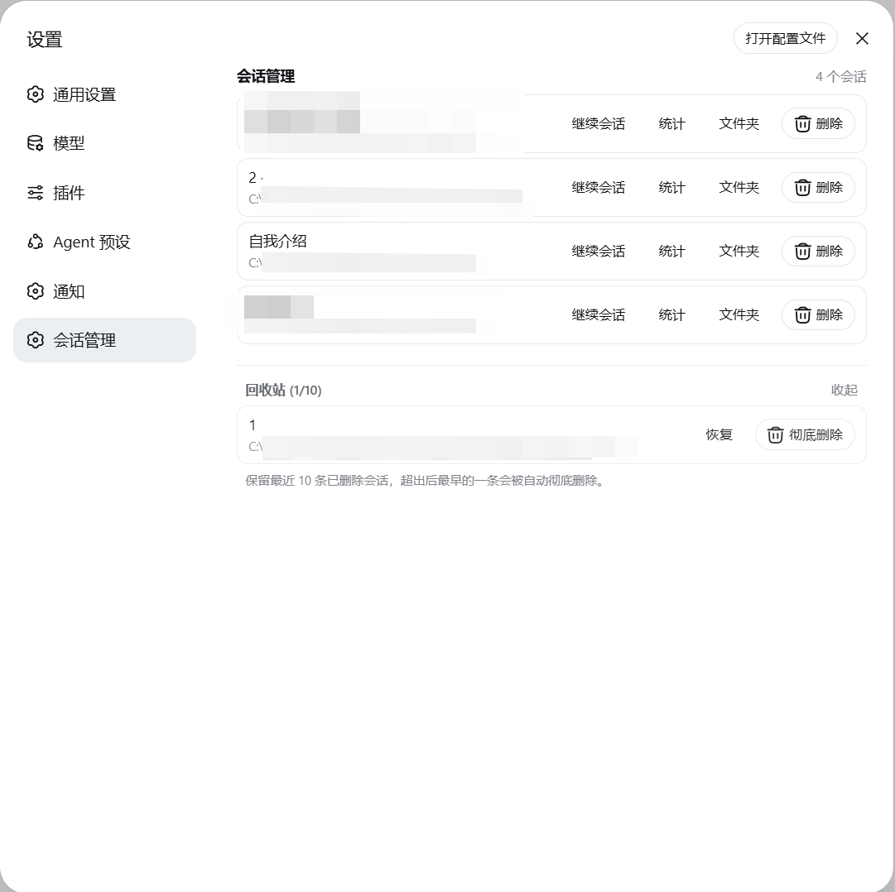

# dsh-delete-session

English | [中文](README.md)

Possibly the most feature-complete DSH session manager plugin out there: full session management for the DeepSeek Harness web UI, including delete (with a trash to restore or purge), restore archived sessions, recent-activity stats, continue/pause sessions, and revealing log folders — from a Settings section and the conversation header. No harness changes.

<sub><span style="opacity:.6">Built independently with dsh + Deepseek-V4-Flash0731</span></sub>

## Features

- A dedicated **Session Manager** section in Settings (a settings section, sibling to Notifications)
- Lists all sessions (title / working directory); **archived sessions** are grouped in a collapsible area at the bottom with a **one-click Restore** back to the list
- **Trash**: deleted sessions move to the trash (keeps the most recent 10, the oldest is purged automatically), with **Restore** and **Delete permanently** actions
- **Stats**: expand any session to see recent activity (turns / user messages / assistant messages / tool calls / activity window)
- **Continue session**: open a session and close the panel; **Pause**: stop a running session's current turn
- **Folder**: reveal the session's log directory in the system file manager
- **Delete this session**: a red button in the conversation header (left of Session log) to delete the current session
- **Session Manager / Trash** header buttons: a self-drawn right drawer (pin to keep open, outside-click to close)
- **Workspace management**: sessions are grouped by workspace, sorted by last use within each group (toggle newest/oldest first); drag a workspace title to reorder (insert before/after, swap on the title, drag to the bottom to append); hovering a title shows **Move to top / Rename / Delete** buttons (delete follows the official definition: it only removes the workspace from the list — the folder and session logs are kept, and its sessions appear under Ungrouped)
- Delete restriction: only sessions **currently thinking** are protected; an open-but-idle session can be deleted
- Subagent functionality is unaffected: their sessions are managed by DSH delegation, and this plugin does not offer a delete entry for them (end/clean them up within their parent session)
- UI language follows the page language (Chinese / English)

## Screenshots

The Settings "Session Manager" section (with archived group and trash):



Conversation header shortcuts (Session Manager / Trash / Delete this session):


The session management drawer (pin to keep open, outside-click to close):


## Install

### From GitHub

```sh
dsh plugin --profile web add 'github:dream12347/dsh-delete-session#v0.1.4'
```

### From a local directory

```sh
dsh plugin --profile web add /absolute/path/to/dsh-delete-session
```

### From a tarball

```sh
pnpm pack
dsh plugin --profile web add /absolute/path/to/dsh-delete-session-0.1.4.tgz
```

After installing, **restart** `dsh web` (the host plugin and the served client bundle load at startup).

## Usage

### Settings section

1. Open **Settings** (the gear icon at the bottom of the sidebar)
2. A dedicated **Session Manager** section appears in the settings left navigation — click it
3. The main list shows unarchived sessions; the **Archived sessions** collapsible area at the bottom lets you view, **restore**, or delete archived sessions
4. Deleting moves a session to the **Trash** collapsible area (keeps the most recent 10)
5. In the trash you can **Restore** (back to the list) or **Delete permanently** (irreversible)
6. Per-row actions: **Continue session** (open and enter), **Pause** (stop the running turn), **Stats** (expand recent activity), **Folder** (reveal the log directory), **Delete**
7. Workspace title actions (shown on hover): **Move to top**, **Rename**, **Delete** (red, with a confirmation dialog)
8. Drag a workspace title to reorder: drop above/below another workspace to insert, drop on a title to swap, drag to the very bottom to append
9. The sort toggle (newest first / oldest first) switches the session order inside each group

### Conversation header shortcuts

Top right of any conversation (left of Session log):
- **Session Manager**: opens the management drawer (full list + archived + trash); pin it to keep open, outside-click closes it
- **Trash**: opens the drawer with the trash expanded
- **Delete this session** (red): deletes the current conversation (moves it to the trash)

## How it works

| Layer | Implementation |
|---|---|
| Host | `src/index.ts` registers the webserver route `POST /dsh-delete-session/delete`. It resolves the session via `ctx.sessionPersistence`, archives it first through `ctx.workspaceRegistry` (the official channel hides the row on every connected client immediately), then removes the log directory on disk; `ctx.agents` detects running sessions and refuses to delete them |
| Client | `src/client/index.ts` registers the dedicated section through the official `settings.section` slot, lists sessions (with the archived group) from the `useSessions` / `useWorkspaces` standard feeds, and calls the host route to delete; removed session ids are remembered in browser localStorage so a live session does not "resurrect" after refresh |

- Deletion goes through the official archive channel first: the sidebar hides the session immediately
- Workspace accounting (`sessionIds` slots / the archive set) is reconciled automatically on the next startup when the registry rebuilds its header index — no manual file editing
- No system-prompt changes, no new model-facing tools: zero impact on tokens and model behavior

## Limitations

- **Running sessions cannot be deleted** (button disabled and the host refuses); with multiple tabs, stop the session elsewhere first
- Subagent sessions cannot be deleted
- A live session (opened in this process) has its in-memory state cleaned up by DSH on restart; deleted ids are recorded in browser localStorage so they do not reappear after a refresh

## Compatibility

Current version targets DSH `0.1.0-rc.6` (depends on the `settings.section` slot and the `ctx.sessionPersistence` / `ctx.workspaceRegistry` / `ctx.agents` services). If slots or service APIs change in a future DSH version, the plugin needs a matching update.

## Development

```sh
pnpm install        # installs dependencies (@deepseek-ai packages are linked local dev dependencies)
pnpm run check      # typecheck + test + build
```

`lib/` holds the committed build artifacts: rebuild and commit `lib/` with every source change.
